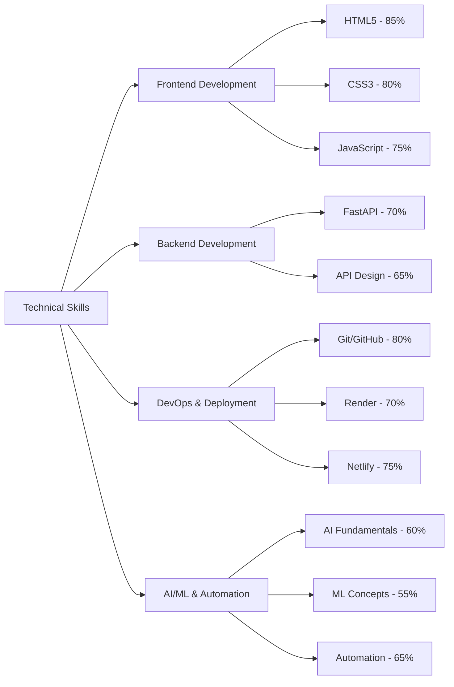
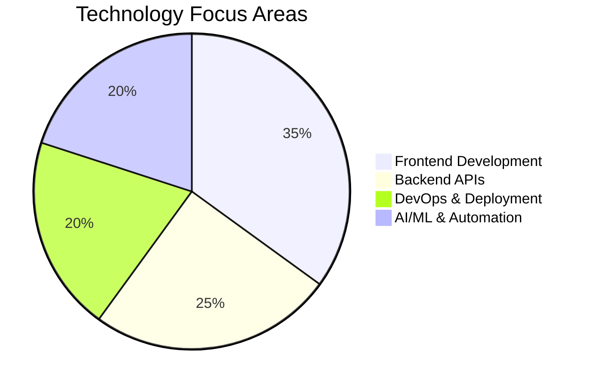

# Aditya Shah
**AI/ML Enthusiast & Full-Stack Developer**

## About Me
I'm Aditya Shah, currently pursuing my studies at PESCE Mandya with a passionate focus on Artificial Intelligence, Machine Learning, and automation technologies. I'm driven by the potential of AI to solve real-world problems and create innovative solutions that make a meaningful impact.

## Technical Skills

### Skill Proficiency Chart


### Learning Progress Timeline
```mermaid
gantt
    title Learning Journey & Future Goals
    dateFormat  YYYY-MM-DD
    section Foundation
    HTML/CSS Mastery    :done, foundation, 2023-01-01, 2023-06-30
    JavaScript Core     :done, js, 2023-04-01, 2023-09-30
    
    section Backend & Tools
    FastAPI Development :done, fastapi, 2023-07-01, 2023-12-31
    Git/GitHub Workflow :done, git, 2023-06-01, 2023-10-31
    Cloud Deployment    :done, deploy, 2023-09-01, 2024-01-31
    
    section AI/ML Focus
    AI/ML Fundamentals  :active, aiml, 2024-01-01, 2024-08-31
    Advanced ML Projects:planned, advanced, 2024-06-01, 2024-12-31
    Deep Learning       :planned, dl, 2024-09-01, 2025-03-31
```

### Technical Stack Distribution


### Frontend Development
- **HTML5** - Semantic markup and modern web standards
- **CSS3** - Responsive design, Flexbox, Grid, animations
- **JavaScript** - ES6+, DOM manipulation, async programming
- **Exploring TypeScript**
  
### Backend Development
- **FastAPI** - High-performance Python web framework for building APIs

### Development Tools & Platforms
- **Git & GitHub** - Version control and collaborative development
- **Render** - Cloud deployment and hosting
- **Netlify** - Frontend deployment and continuous integration

### Areas of Interest & Learning
- **Artificial Intelligence** - Neural networks, deep learning fundamentals
- **Machine Learning** - Supervised/unsupervised learning, model training
- **Automation** - Process automation and workflow optimization
- **Data Science** - Data analysis and visualization

## Current Focus
- Expanding knowledge in AI/ML algorithms and frameworks
- Building full-stack applications with modern web technologies
- Exploring automation solutions for everyday problems
- Contributing to open-source projects

## Goals
- Develop expertise in advanced ML frameworks (TensorFlow, PyTorch)
- Create AI-powered web applications
- Contribute to innovative automation projects
- Build a portfolio of impactful AI/ML solutions

---
*"In The Journey of Becoming the Best"*
