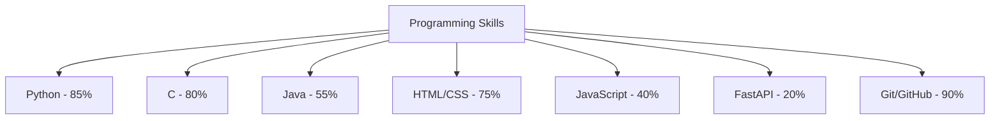
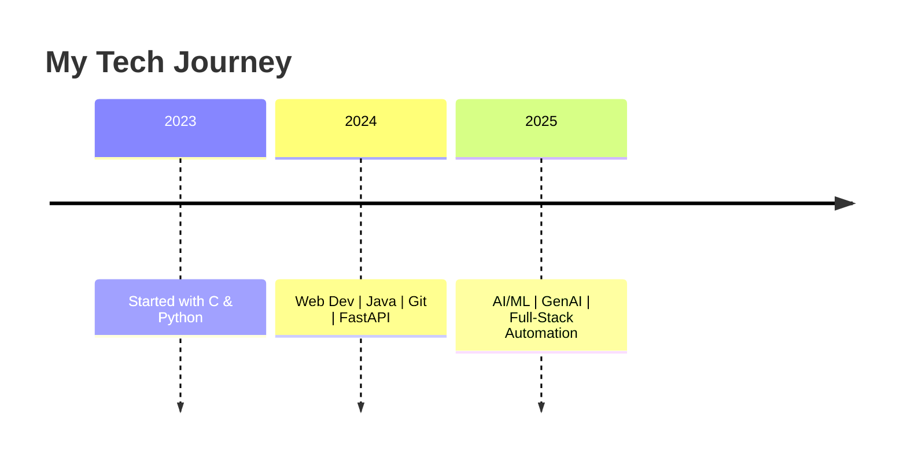
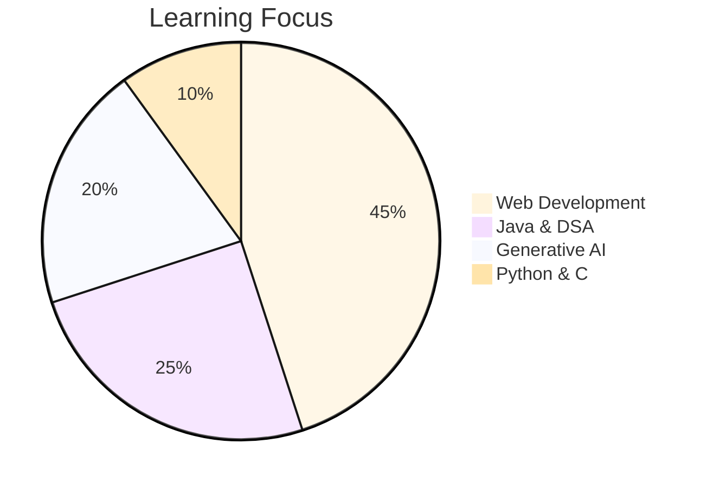
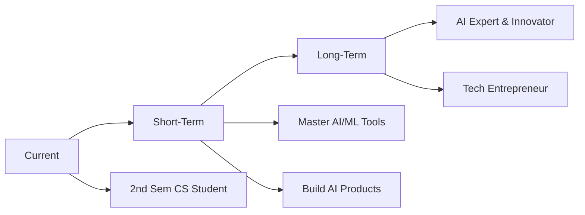

# Hey Guys, I'm Aditya Shah!

<div align="center">
  
</div>

<div align="center">
  
  
  
</div>

<div align="center">
  
</div>

## About Me

> "In the Journey of Becoming The Best"

I'm **Aditya Shah**, a 2nd-semester Computer Science student at **PESCE Mandya**, passionate about **AI/ML**, **Automation**, and **Full-Stack Development**. I'm always striving to learn, build, and grow in the field of tech.

---

## What Drives Me

- AI/ML Enthusiast – Exploring intelligent systems  
- Automation Advocate – Optimizing repetitive tasks  
- Full-Stack Explorer – Building complete solutions  
- Generative AI Fan – Innovating with cutting-edge AI tools  
- Continuous Learner – Always upskilling  

---

## Tech Stack

### Languages

<p align="center">
  
  
  
  
</p>

### Web Development

<p align="center">
  
  
  
  
</p>

### Tools & Platforms

<p align="center">
  
  
  
  
  
</p>

---

## Programming Proficiency



## Learning Timeline 



## Interest Distribution



## Development Focus

```mermaid
class AIMLExplorer:
    def __init__(self):
        self.name = "Aditya Shah"
        self.interests = ["AI/ML", "Automation", "GenAI", "Full-Stack Dev"]
        self.goals = [
            "Master AI/ML",
            "Automate workflows",
            "Build intelligent apps",
            "Contribute to Open Source"
        ]

```
## Future Vision 


