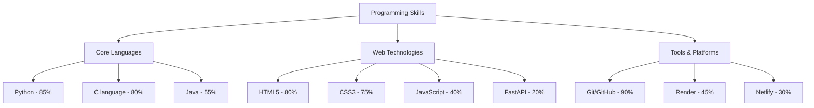
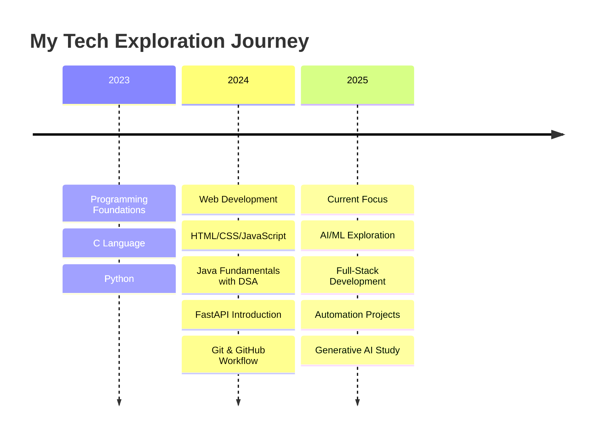
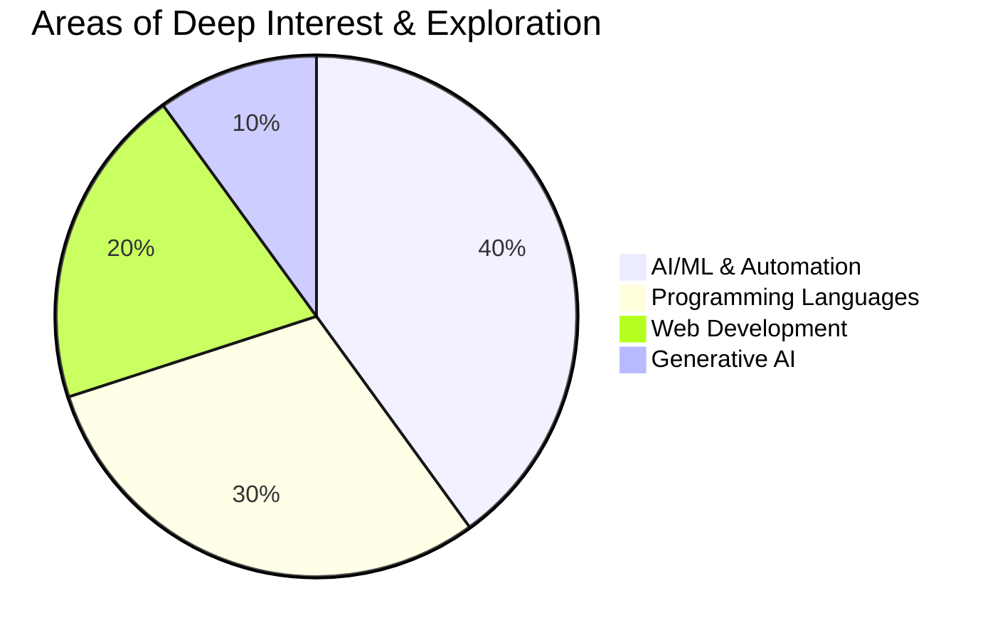

# Aditya Shah
**Computer Science Student | AI/ML Explorer | Full-Stack Development Enthusiast**

## About Me
I'm Aditya Shah, a 2nd semester Computer Science student at PESCE Mandya with an insatiable curiosity for technology and innovation. Currently exploring the fascinating worlds of Artificial Intelligence, Machine Learning, Automation and Full-Stack Development. I have a deep passion for AI/ML, automation, and Generative AI, and I'm excited about the endless possibilities these technologies offer to transform our world.

## Technical Skills

### Programming Proficiency

### Learning Journey

### Interest Areas Focus

### Core Programming Languages
- **Java** - Object-oriented programming, data structures, algorithms
- **Python** - Versatile programming for web development and AI/ML exploration
- **C Language** - System programming fundamentals and memory management

### Web Development Stack
- **HTML5** - Semantic markup and modern web standards
- **CSS3** - Responsive design, Flexbox, Grid, animations
- **JavaScript** - ES6+, DOM manipulation, async programming
- **FastAPI** - Python web framework for building APIs
- **TypeScript** - Enhanced Variant of JavaScript (Exploring)

### Development Tools & Platforms
- **Git & GitHub** - Version control and collaborative development
- **Render** - Cloud deployment and hosting
- **Netlify** - Frontend deployment and continuous integration

### Current Exploration Areas
- **Artificial Intelligence** - Exploring AI fundamentals and applications
- **Machine Learning** - Learning algorithms and model concepts
- **Automation** - Process automation and workflow optimization
- **Generative AI** - Understanding and experimenting with GenAI tools
- **Full-Stack Development** - Combining frontend and backend skills

## Current Focus
As a 2nd semester student, I'm actively:
- **Exploring AI/ML Fundamentals** - Understanding machine learning algorithms and their applications
- **Building Full-Stack Projects** - Combining my programming skills with web technologies
- **Experimenting with Automation** - Creating scripts and tools to streamline processes
- **Studying Generative AI** - Fascinated by the potential of GenAI in various domains
- **Strengthening Programming Foundation** - Deepening expertise in Java, Python, and C

## Future Aspirations
- Master advanced AI/ML frameworks and libraries
- Build innovative AI-powered applications
- Contribute to open-source AI/ML projects
- Develop expertise in Generative AI and automation
- Create solutions that bridge traditional programming with cutting-edge AI

## Connect With Me
*Open to collaborations, learning opportunities, and discussions about AI/ML projects*

---
*"In the Journey of Becoming The Best"*
