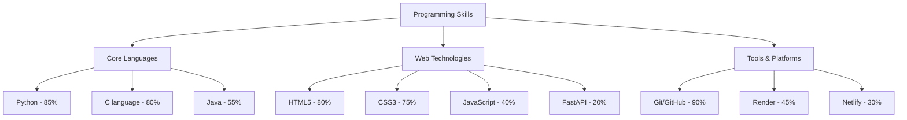
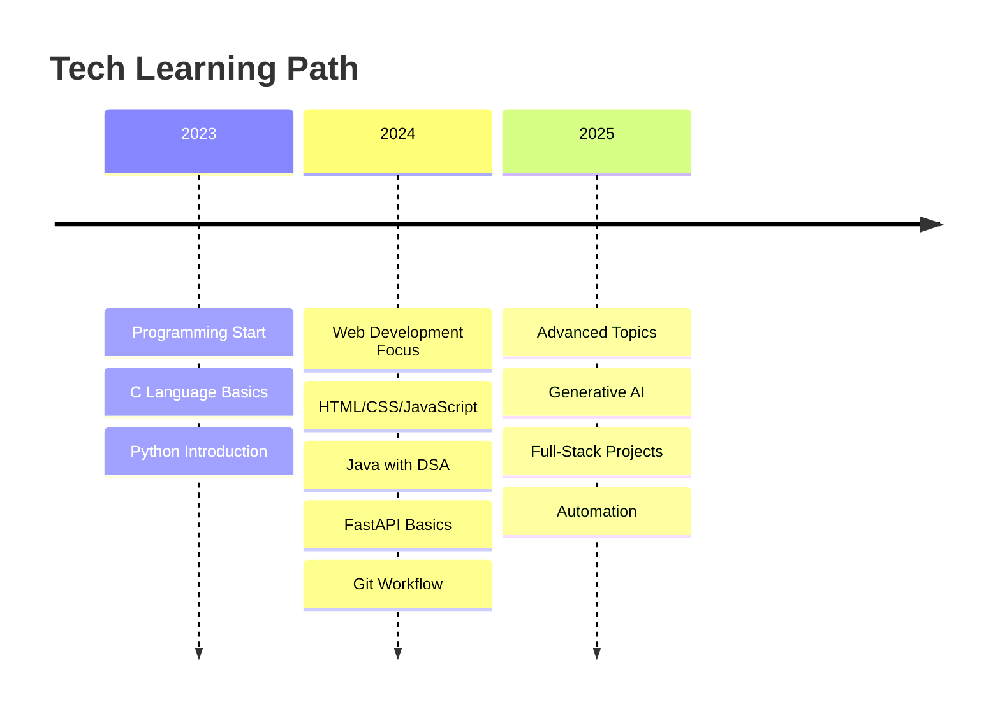
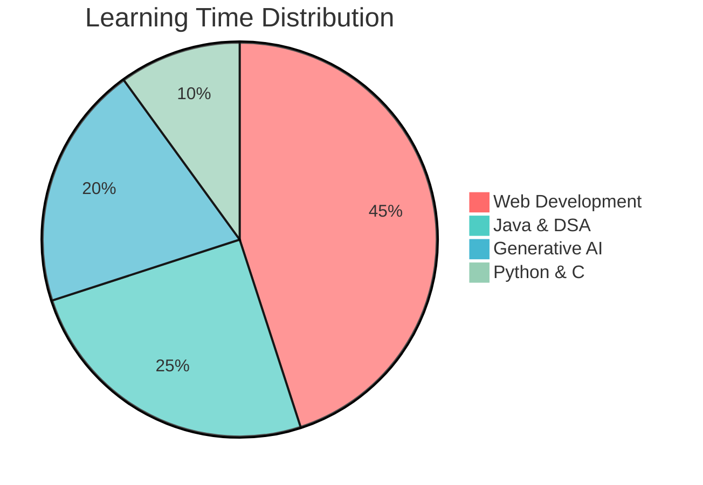
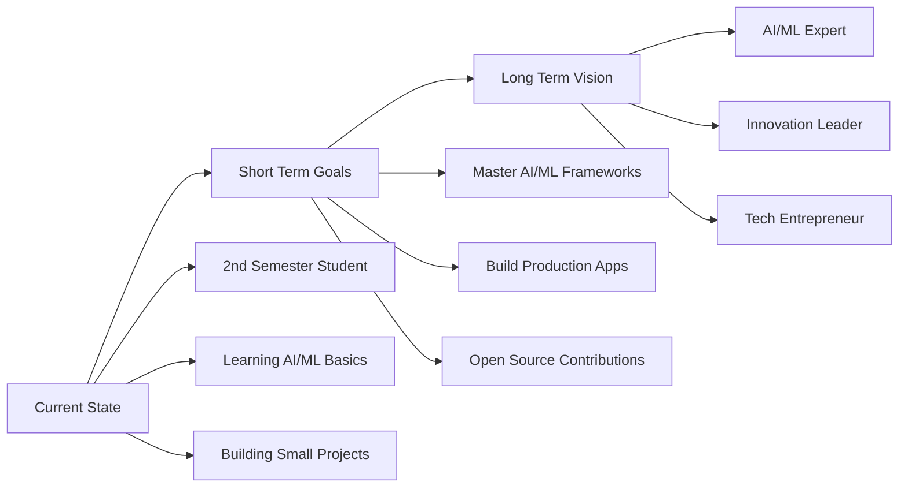

# Hi there, I'm Aditya Shah! 

<div align="center">
  
</div>

<div align="center">
  
  
  
</div>

<div align="center">
  
</div>

##  About Me

> **"In the Journey of Becoming The Best"**

I'm **Aditya Shah**, a 2nd semester Computer Science student at **PESCE Mandya** with an insatiable curiosity for technology and innovation. Currently exploring the fascinating worlds of **Artificial Intelligence**, **Machine Learning**, **Automation** and **Full-Stack Development**. 

I have a deep passion for **AI/ML**, **automation**, and **Generative AI**, and I'm excited about the endless possibilities these technologies offer to transform our world.

###  What Drives Me
-  **AI/ML Enthusiast** - Fascinated by intelligent systems and their potential
-  **Automation Advocate** - Love creating solutions that work smarter, not harder
-  **Full-Stack Explorer** - Building end-to-end solutions with modern technologies
-  **Generative AI Pioneer** - Exploring the cutting-edge of AI creativity
-  **Continuous Learner** - Always expanding my knowledge horizon

## 🛠️ Technical Arsenal

### Programming Languages
<div align="center">
  
  
  
  
</div>

### 🌐 Web Development Stack
<div align="center">
  
  
  
  
</div>

### AI/ML & Data Science (Exploring)
<div align="center">
  
  
  
  
</div>

###  Tools & Platforms
<div align="center">
  
  
  
  
  
</div>

##  Programming Proficiency



## Learning Journey Timeline



## Interest Areas Focus

<div align="center" style="max-width: 400px;">



</div>

## GitHub Analytics

<div align="center">
  
  
</div>

<div align="center">
  
  
</div>

##  GitHub Achievements

<div align="center">
  
</div>

##  Current Development Focus

```python
class AIMLExplorer:
    def __init__(self):
        self.name = "Aditya Shah"
        self.role = "Computer Science Student"
        self.institution = "PESCE Mandya"
        self.semester = "2nd"
        
        self.core_interests = [
            "Artificial Intelligence",
            "Machine Learning", 
            "Automation",
            "Generative AI",
            "Full-Stack Development"
        ]
        
        self.current_exploration = {
            "ai_ml": ["TensorFlow", "Scikit-learn", "Neural Networks"],
            "automation": ["Python Scripts", "Workflow Optimization"],
            "web_dev": ["FastAPI", "React", "TypeScript"],
            "gen_ai": ["ChatGPT APIs", "Prompt Engineering", "AI Tools"]
        }
    
    def current_goals(self):
        return [
            "Master AI/ML fundamentals and frameworks",
            "Build innovative automation solutions", 
            "Create full-stack AI-powered applications",
            "Contribute to open-source AI projects",
            "Share knowledge through documentation and tutorials"
        ]
    
    def future_vision(self):
        return "Building intelligent solutions that bridge traditional programming with cutting-edge AI"

student = AIMLExplorer()
print("Ready to transform ideas into intelligent solutions!")
```

## Current Focus Areas

### AI/ML Exploration
- **Exploring AI Fundamentals** - Understanding machine learning algorithms and their applications
- **Hands-on Projects** - Building ML models and experimenting with datasets
- **Algorithm Study** - Deep diving into supervised, unsupervised, and reinforcement learning

### Automation & Scripting  
- **Process Automation** - Creating Python scripts to streamline workflows
- **Task Optimization** - Building tools that work smarter, not harder
- **Workflow Enhancement** - Automating repetitive development tasks

### Full-Stack Development
- **Frontend Skills** - Modern HTML5, CSS3, and JavaScript (ES6+)
- **Backend Development** - FastAPI for building robust APIs
- **Deployment Experience** - Using Render and Netlify for project hosting

### Generative AI Study
- **GenAI Tools** - Experimenting with AI-powered development tools
- **Prompt Engineering** - Learning effective AI interaction techniques
- **AI Integration** - Incorporating AI capabilities into applications

## 📈 Weekly Development Breakdown

<!--START_SECTION:waka-->
```text
Python       12 hrs 45 mins  ██████████████▓░░░░░░   58.7%
Java         4 hrs 32 mins   █████▒░░░░░░░░░░░░░░░   20.9%
JavaScript   2 hrs 15 mins   ██▓░░░░░░░░░░░░░░░░░░   10.4%
HTML/CSS     1 hr 48 mins    ██░░░░░░░░░░░░░░░░░░░    8.3%
C            25 mins         ▒░░░░░░░░░░░░░░░░░░░░    1.7%
```
<!--END_SECTION:waka-->


## Future Aspirations



### Goals & Ambitions
- **Master Advanced AI/ML** - Deep expertise in TensorFlow, PyTorch, and cutting-edge frameworks
- **Build Innovative Applications** - Create AI-powered solutions that solve real-world problems
- **Open Source Contributor** - Actively contribute to major AI/ML and automation projects
- **Knowledge Sharing** - Mentor others and share insights through blogs and tutorials
- **Technology Innovation** - Pioneer solutions that bridge traditional programming with AI

## Tech Philosophy

> *"The best way to predict the future is to invent it. In the rapidly evolving world of AI and technology, I believe in continuous learning, hands-on experimentation, and building solutions that make a meaningful impact."*

## Coding Vibes

<div align="center">
  
</div>

## Random AI/ML Fact

<div align="center">
  
</div>

---

<div align="center">
  
</div>

<div align="center">
  <i> "In the Journey of Becoming The Best" </i>
  <br><br>
  <i>From <a href="https://github.com/adityashah">Aditya Shah</a> with 💜</i>
</div>
